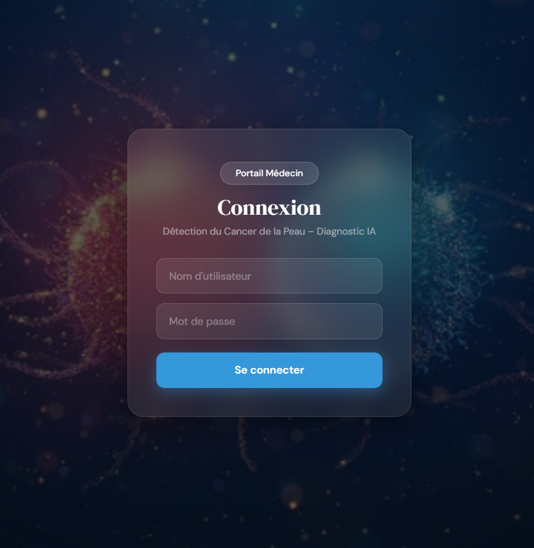
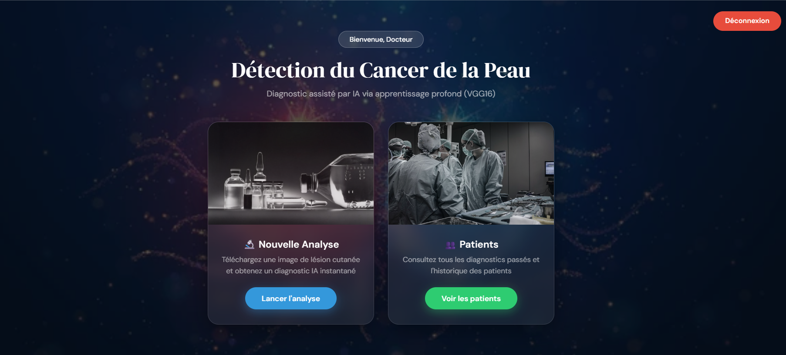
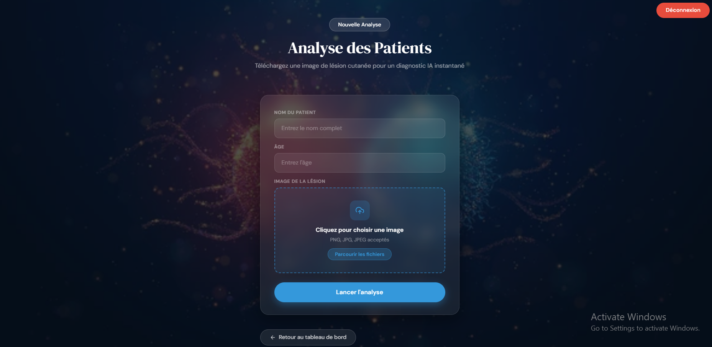
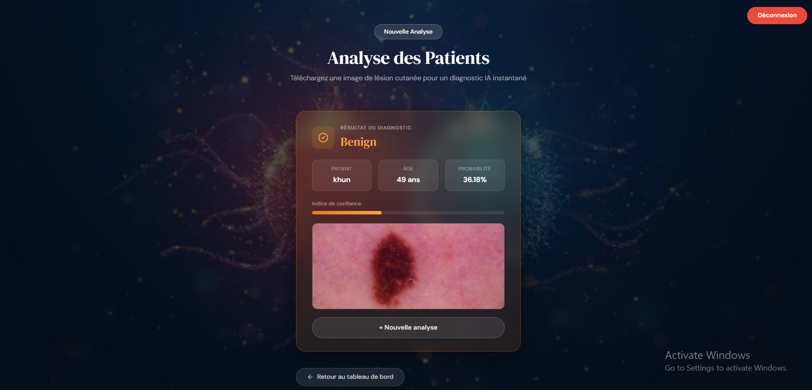
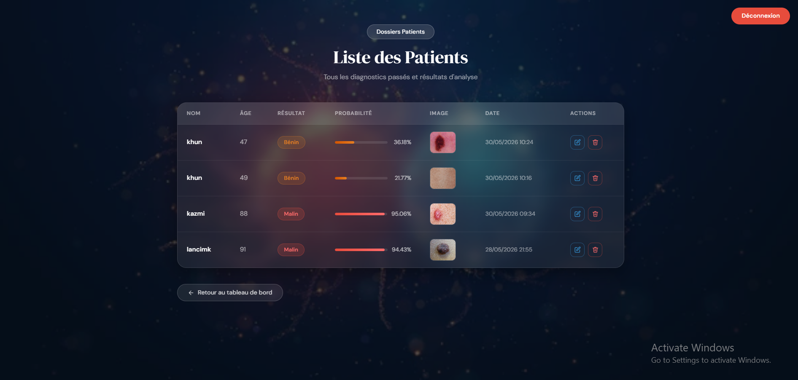

# Détection du Cancer de la Peau
### Plateforme de Diagnostic Dermatologique Assistée par IA

Une application web full-stack qui utilise le transfer learning sur VGG16 pour classifier les lésions cutanées en bénignes ou malignes. Les médecins peuvent télécharger des images dermoscopiques, recevoir des diagnostics instantanés et gérer les dossiers patients via une interface sécurisée.

---

## Démonstration

https://1drv.ms/v/c/611912a2f5a1579b/IQBfq5HkymHwRan1Yd_bN-mmAfe21G6fnV3dilNSA-ta74A?e=qYG0DR

---

## Captures d'écran

---

### Connexion


---

### Tableau de bord


---

### Formulaire d'analyse


---

### Résultat du diagnostic


---

### Dossiers patients


---

## Fonctionnalités

- Authentification sécurisée avec gestion de session et protection CSRF
- Téléchargement d'image dermoscopique avec diagnostic IA instantané
- Score de confiance affiché avec une barre de progression animée
- Sauvegarde automatique des résultats dans les dossiers patients
- Gestion complète des patients : ajout, modification, suppression, tableau paginé
- Interface responsive avec effet glassmorphism

---

## Architecture du Modèle

Basé sur **VGG16** pré-entraîné sur ImageNet avec une tête de classification personnalisée pour la détection binaire de lésions cutanées.
| Couche | Détail |
|--------|--------|
| Entrée | 224 × 224 × 3 |
| Base | VGG16 (gelée) |
| 1 | Flatten |
| 2 | Dense(256, ReLU) |
| 3 | Dropout(0.5) |
| Sortie | Dense(1, Sigmoid) |

| Paramètre | Valeur |
|-----------|--------|
| Optimiseur | Adam (lr = 0.0001) |
| Fonction de perte | Binary Crossentropy |
| Époques | 10 |
| Images d'entraînement | 493 |
| Images de test | 132 |
| Précision de test | **80%** |

---

## Performance

| Classe | Précision | Rappel | F1-Score | Support |
|--------|-----------|--------|----------|---------|
| Bénin | 0.74 | 0.76 | 0.75 | 51 |
| Malin | 0.85 | 0.83 | 0.84 | 81 |
| **Précision globale** | | | **0.80** | **132** |

---

## Stack Technique

| Couche | Outils |
|--------|--------|
| Backend | Python, Flask, Flask-WTF |
| IA / ML | TensorFlow, Keras, VGG16 |
| Base de données | MySQL, XAMPP |
| Frontend | HTML5, CSS3, Bootstrap 5, JavaScript |
| Sécurité | Protection CSRF, sessions côté serveur |

---

## Structure du Projet

```
SKIN_CANCER_APP/
├── model/
│   └── vgg16_skin_cancer.h5
├── static/
│   ├── uploads/
│   ├── bj.jpg
│   └── style.css
├── templates/
│   ├── login.html
│   ├── dashboard.html
│   ├── predict.html
│   ├── result.html
│   └── patients.html
└── app.py
```

## Installation

**1. Cloner le dépôt**
```bash
git clone https://github.com/yassminesridi-beep/skin-cancer-detection.git
cd skin-cancer-detection
```

**2. Installer les dépendances**
```bash
pip install flask flask-wtf tensorflow numpy mysql-connector-python werkzeug
```

**3. Configuration de la base de données**

Démarrez XAMPP, ouvrez phpMyAdmin et exécutez :

```sql
CREATE DATABASE skin_cancer_db;
USE skin_cancer_db;

CREATE TABLE users (
    id INT AUTO_INCREMENT PRIMARY KEY,
    username VARCHAR(100) NOT NULL,
    password VARCHAR(255) NOT NULL
);

CREATE TABLE patients (
    id INT AUTO_INCREMENT PRIMARY KEY,
    name VARCHAR(100),
    age INT,
    result VARCHAR(20),
    probability FLOAT,
    image_path VARCHAR(255),
    created_at TIMESTAMP DEFAULT CURRENT_TIMESTAMP
);

INSERT INTO users (username, password) VALUES ('admin', '1234');
```

**4. Ajouter le modèle**

Placez votre modèle entraîné à l'emplacement suivant :
model/vgg16_skin_cancer.h5

**5. Lancer l'application**
```bash
python app.py
```

Ouvrez [http://localhost:5000](http://localhost:5000) dans votre navigateur.

---

## Identifiants
Nom d'utilisateur : admin

Mot de passe : 1234

---

## Contexte Académique

Développé dans le cadre du module **Intelligence Artificielle** sous la supervision du **Professeur Amira Echtioui**, programme Technologies Avancées — **ENSTAB**.

**Auteur — Yasmine Sridi**

---

> Cette application est destinée à un usage académique uniquement et ne remplace pas un diagnostic médical professionnel.
